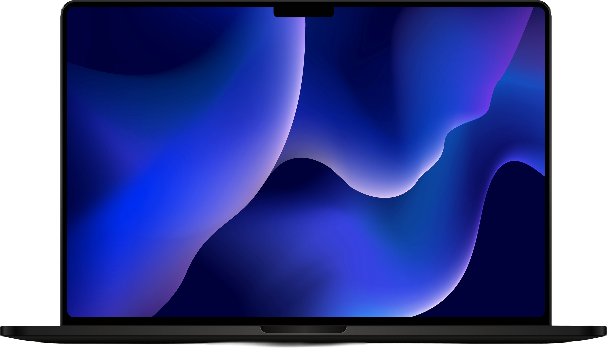

# monah

> A focus timer for Notion. Keeps your current task in view and tracks the time back to it.

[Download for macOS](https://monahapp.com/download) · [Set up](https://monahapp.com/setup) · [What's new](https://monahapp.com/whats-new) · [Pro features](https://monahapp.com/pro)

## What it does

- Pins the current Notion task to the top of your screen while you work — minimal, always visible
- Pomodoro timer with a progress widget, tied to the task you picked
- Time you spent on each task writes back to a Notion field — use it in any view, filter, or chart
- Native macOS app, signed and notarized by Apple, runs on Apple Silicon and Intel
- One-time $12 for Pro (custom widget colors, project filtering); free tier is fully useful on its own
- No subscription, no ads

## Install

Download the signed `.dmg` from [monahapp.com/download](https://monahapp.com/download). Opens without Gatekeeper warnings.

## Set up

Three steps: sign in to Notion, point monah at your task database, pick a status mapping. See [monahapp.com/setup](https://monahapp.com/setup).

## Report a bug · request a feature

Open an issue here, or email [support@monahapp.com](mailto:support@monahapp.com).

## About this repository

monah is a paid macOS app. **The source is closed during the validate stage.** This repository is the public face — release notes, bug reports, feature requests.

- Release notes: [CHANGELOG.md](CHANGELOG.md) (also at [monahapp.com/whats-new](https://monahapp.com/whats-new))
- Privacy: [monahapp.com/privacy](https://monahapp.com/privacy)
- Terms: [monahapp.com/terms](https://monahapp.com/terms)

---

Built by [Denis Gomes](https://github.com/denisg0mes). © 2026.
